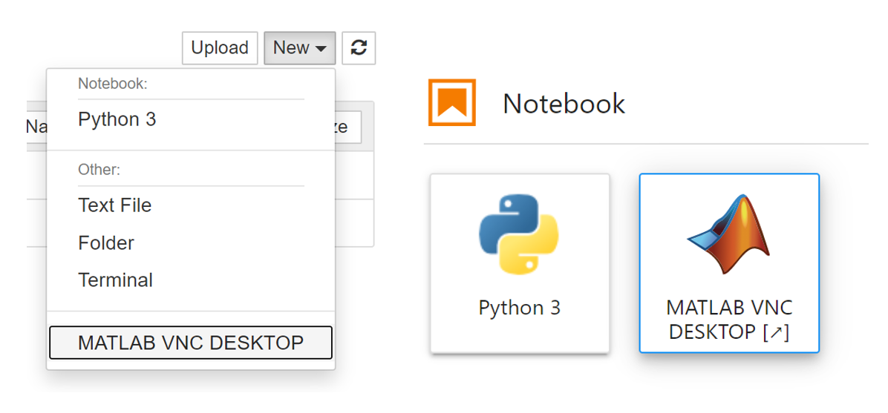

# MATLAB Integration for Jupyter using VNC

The `jupyter-matlab-vnc-proxy` Python® package allows you to integrate MATLAB® with Jupyter®. The MATLAB integration for Jupyter using VNC allows you to connect to a Linux® desktop, with MATLAB installed, from your Jupyter environment.

If you have access to MATLAB R2020b or later, we recommend using the alternative package [`jupyter-matlab-proxy`](https://github.com/mathworks/jupyter-matlab-proxy) which comes with some limitations (see [Specifications and Limitations](https://www.mathworks.com/products/matlab-online/limitations.html)). This alternative enables you to open a MATLAB desktop in a web browser tab, directly from your Jupyter environment.

## Use the MATLAB Integration for Jupyter using VNC

Once you have a Jupyter environment with the `jupyter-matlab-vnc-proxy` package installed, to use the integration, follow these steps:

1. Open your Jupyter environment.
2. If you are using Jupyter Notebook (on the left in figure below), on the `New` menu, select `MATLAB VNC DESKTOP`. If you are using JupyterLab (on the right in figure below), select the `MATLAB VNC DESKTOP` icon on the launcher.

<p align="center">
  
</p>

3. Wait for the Linux desktop to start. Reload the webpage if the connection fails to load.
4. To use MATLAB, locate the MATLAB icon in the Linux desktop and double click on it and wait for it to start.

## Installation

If you want to install the `jupyter-matlab-vnc-proxy` package in a Jupyter Docker® image, see [Use MATLAB Integration for Jupyter using VNC in a Docker Container](https://github.com/mathworks-ref-arch/matlab-integration-for-jupyter/tree/main/matlab-vnc). Otherwise, if you want to install the `jupyter-matlab-vnc-proxy` package into a preexisting Jupyter environment, follow the instructions below.

To install the `jupyter-matlab-vnc-proxy` package, follow these steps in your Jupyter environment:

1. Install a MATLAB 64 bit Linux version. Make sure the the installation folder is on the system path.
2. Install software packages that MATLAB depends on and software packages that this integration depends on.
For a list of required software packages in a Debian based distribution, inspect [this Dockerfile](https://github.com/mathworks-ref-arch/matlab-integration-for-jupyter/blob/main/matlab-vnc/Dockerfile).
3. Create the environment variable `NOVNC_PATH` and store in it the path to the [`noVNC`](https://github.com/novnc/noVNC) package installed in the previous step.
4. Install the `jupyter-matlab-vnc-proxy` package by executing:

   ```bash
   python -m pip install https://github.com/mathworks/jupyter-matlab-vnc-proxy/archive/0.1.0.tar.gz
   ```

If you want to use this integration with JupyterLab®, you must also install `jupyterlab-server-proxy` JupyterLab extension. To install the extension, use the following command:

```
jupyter labextension install @jupyterlab/server-proxy
```

For more information see [GUI Launchers](https://jupyter-server-proxy.readthedocs.io/en/latest/launchers.html#jupyterlab-launcher-extension).


### Integration with JupyterHub

If you want to use this integration with JupyterHub®, then you must install the `jupyter-matlab-vnc-proxy` Python package in the Jupyter environment launched by your JupyterHub platform. For example, if your JupyterHub platform launches Docker containers, then install this package in the Docker image used to launch them. You can find a reference architecture that installs the `jupyter-matlab-vnc-proxy` Python package in a Docker image in the repository [Use MATLAB Integration for Jupyter using VNC in a Docker Container](https://github.com/mathworks-ref-arch/matlab-integration-for-jupyter/tree/main/matlab-vnc).


## Feedback

We encourage you to try this repository with your environment and provide feedback – the technical team is monitoring this repository. If you encounter a technical issue or have an enhancement request, send an email to `jupyter-support@mathworks.com`.
